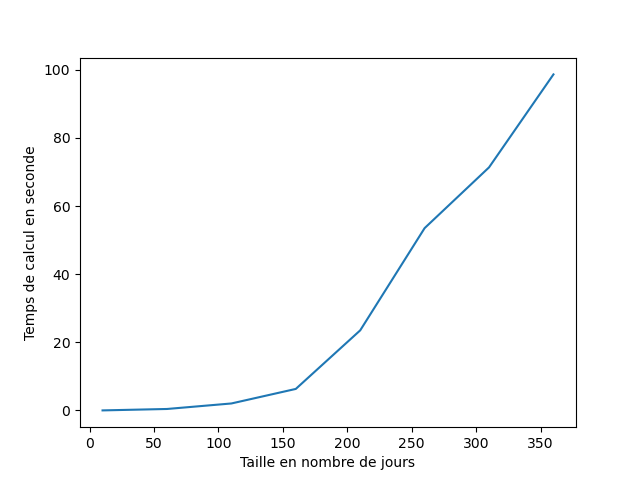

# mines_strat_gaz_nat

Projet Ecole des Mines de PARIS en partenariat avec E_Cube : 

- *Sebastian Partarrieu*
- *Pierre-Adrien Plessix*
- *Youri Tchouboukoff*

to install useful Packages of this project, type : 
```
pip install -r requirements.py
pip install -e .
```

## Partie 1 : Web_Scraping
-------------------
  > Ce module repose sur un driver, `chromedriver.exe`, fournit avec le repo, et disponible à la racine du Repo. Il est nécessaire de posséder Chrome pour faire fonctionner les tâches automatisées. 
Module scrap_saver qui a deux fonctions : initialiser la BDD et updater la BDD. 

Les données sont extraites depuis `https://www.powernext.com/futures-market-data` pour les prix **futures**. Tandis que les prix **Spots** sont issus de `https://www.powernext.com/spot-market-data`. 

Lorsque l'on s'intéresse à la structure générale du site, on comprend mieux comment l'on va s'attaquer à l'extraction des données. On comprend que le contenu est divisé en quatre ou cinq blocs, contenant chacun un graphique et une barre d'onglet permettant d'afficher les données du marché intéressant. 

Cependant le principal problème est que les données ne sont pas stoquées en propre dans le code du site, mais son acquise par une requête d'un script `JavaScript` à une base de donnée extérieure au site. Il est donc nécessaire de se rapprocher le plus possible du comportement utilisateur. 

On utilise donc un module qui permet donc de cliquer sur des boutons. Pour se placer à chaque fois dans les configurations où l'on a accès aux données dans le code HTML. On utilise alors un Parser pour récupérer les données brutes

Dans le cadre de la lecture d'un Graphe, il est nécessaire de pouvoir passer la souris au dessus de la courbe pour avoir accès aux valeurs de prix à cet instant. Encore une fois dans le cas contraire ces données ne sont pas accesible dans le code de la page. On fait donc bouger la souris d'un pas suffisament petit pour passer au dessus de tous les points du graphique. 

Le Package en lui-même est composé de 3 sous-modules :

- `graph_scraper` : Cet itérateur est basé sur un algorithme de lecture des données de type graphes dans une page de Powernext, ce qui dans notre cas correspond à l'extraction de prix _Spots_. Il utilise le module `Selenium` pour bouger la souris sur toute la largeur du graphique. Il itère sur toutes les types de _GNL_ différend. 
    - `Parameters`:
      - Il prend en argument `specific_type`, par défaut `False` , mais on peut ainsi accéder un type de GNL précis.
      - Il prend en argument `link`, le lien auquel chercher le lien le graphique. 
      - Il prend en argument `bloc_number`, le numéro du bloc qui contient le graphe sur la page. Par défaut 0 dans le cadre de la page qui contient les prix spots. 
    - `Return` : 
      - Il retourne de façon itérative, l'ensemble des données de prix contenus sur la page, l'unité ainsi que le type de GNL considéré. 
      - Dans l'ordre `unit, active, table `
    - La fonction lève des exceptions quand : 
      - **LEVER DES EXCEPTIONS**
      - 
- <a id = 'table_scraper'>`table_scraper`</a> :  C'est itérateur est basé sur un algorithme de lecture des données de type tableau dans une page de Powernext, ce qui dans notre cas correspond à l'extraction de prix _Forward_. Il utilise le module `Selenium` pour accéder au code contenu dans le code `HTML`. Il itère sur toutes les types de _GNL_ différents.
    - `Parameters`:
      - Il prend en argument `specific_type`, par défaut `False` , mais on peut ainsi accéder un type de GNL précis.
      - Il prend en argument `link`, le lien auquel chercher le lien le graphique. 
      - Il prend en argument `bloc_number`, le numéro du bloc qui contient le graphe sur la page. Par défaut 3 dans le cadre de la page qui contient les prix forwards.

    - `Return` : 
      - Il retourne de façon itérative, l'ensemble des données de prix contenus sur la page, l'unité ainsi que le type de GNL considéré. 
      - Dans l'ordre `unit, active, table `
    - La fonction lève des exceptions quand : 
      - Top

  > Ces deux modules ont donc une architecture assez similaire, et les méthodes de Scrapping, que ce soit dans le cadre de graphe, ou bien dans le cadre de tableaux, sont intégrés dans une classe `Browser`.
  

- `scrap_saver` : Fonction qui construit et update la base de données à partir des données fournies par les `Browser` de  <a href= #table_scraper>`table_scraper`</a> et `graph_scraper`, en deux partie, il scrappe d'abord toutes les données du jour, et enfin il ajoute aux données existantes les données qui n'ont pas été encore enregistrées. 
  > On considère ici que il n'y a pas de consolidation à posteriori des données. Faisant que les données précedemment enregistrées ne puissent plus être considérée valables
  - Le Module est lancé par appel dans le terminal de la commande :
`python strat_gaz/scrap/scrap_saver.py -d data_directory -p Product_type -s Specific_Market`
    - Où `-d/--directory` correspond à la position relative du fichier d'enregistrement des données
    - Où `-p/--product` correspond au type de produit dont on désire la mise à jour, si non spécifié les deux, sinon rentrer `'Spot' ou 'Forward'`
    - Où `-s/--specific` correspond au marché désiré. On peut utiliser un des acronymes disponibles sur **Powernext**.  
    - L'appel avec `-h / --help` permet d'afficher l'aide. 

  - Le Module retourne l'ensemble des données mises à jour (si elles n'existent pas, le module crée l'architecture de donnée) au format `.csv`  

> Dans notre mise en place, les données les plus récentes sont sockées dans le fichier `./Data`. Où certaines sauvegardes sont conservées


## Partie 2 : Diffusion de Prix 
-------------------
Module Diffusion_prix qui a pour objectif de génerer des diffusions de prix spot (instantané) à partir des données récupérées dans le module 1, c'est à dire l'historique des prix spots et forwards sur différents marchés, notamment PEG (France).

Le module fonctionne aussi avec des historiques de prix d'autres sources, avec un prétraitement préalable pour que les fichiers csv en entrée du module aient un format adapté.

L'utilisation se fait au travers de la classe `DiffusionSpot` définie dans le script `NewDiffusion.py`. 
Cette classe est dotée de nombreuses fonctions facilitant l'utilisation des données, l'utilisation des dates et les fonctions permettant la diffusion de prix spot. Le détail de chaque fonction se trouve dans la documentation de la classe, accessible via l'attribut `__doc__` pour chacune de ces fonctions. On détaillera brièvement certaines d'entre elles lors de l'explication des scripts d'exécution.

Il y a aussi quatres scripts `exec.py`, `exec2.py`, `exec3.py` et `execRF.py` qui illustrent la bonne utilisation de la classe DiffusionSpot dans quatres scénarios différents et avec un prétraitement lorsque nécessaire.

- `exec.py`: path 1 et path 2 correspondent aux paths locaux des fichiers spots et forward récupérés avec le module 1. Ce script implémente une diffusion autour d'une courbe de forward issue à la date de début de la simulation. Ainsi, au premier jour de la simulation on prend les forwards donnés pour les quatres mois à venir et on effectue une diffusion du prix spot autour de ces forwards fixes. 
  >On considère implicitement que le prix spot du gaz naturel devrait converger vers le prix forward issu précédemment. Si l'on note $S(t)$ le prix spot à un moment $t$ et $F(t, T)$ le prix forward donné à l'instant $t$ pour un contrant maturant à $T$. Ceci revient à dire que $S(t) \rightarrow_{t \rightarrow T} F(t, T)$. C'est discutable et on essaiera de se passer de cette hypothèse par la suite.
  - Le script nécessite de définir 5 dates. start_date_long et end_date_long définissent la période sur laquelle on estime les paramètres à long terme. Ici ils ne sont pas définis car pas nécessaires, on estime seulement la volatilité été/hiver (le marché du gaz naturel exhibant de fortes caractéristiques saisonnières) sur une période courte, définie par start_date et end_date. 
  - La diffusion est effectuée entre end_date et end_date_sim. **En sortie** : Deux graphiques, un avec les diffusions spot l'autre avec la moyenne de ces diffusions comparée avec les forwards pour vérifier que la diffusion se fait bien autour de ces derniers. Un csv avec les 100 diffusions spots et la moyenne des scénarios. On utilise les fonctions `multiple_price_scenarios` et `show_multiple`.

- `exec2.py`: On utilise ici uniquement un historique de prix spot et pas de forward (avec un peu de formattage préalable). L'historique utilisé est Power_next_spot, placé dans le répertoire Diffusion_prix également. L'idée est de faire une diffusion de prix autour d'une moyenne à long terme qui elle même change à chaque pas en fonction de la volatilité long terme observée sur les données historiques. 
  - On défini 5 dates, les dates pour les paramètres à estimer sur le long terme, le court terme et puis la date de la fin de simulation (le début étant pris comme la dernière date utilisée pour l'estimation des paramètres court terme).
  - en créant notre objet diff on fait bien attention à préciser forward_diffusion=False pour spécifier notre intention de faire une diffusion autour d'une moyenne long terme et non pas d'un forward diffusant ou pas.
  - number_of_diffusion correspond au nombre de scénarios voulus
  - On affiche trois graphiques. Le premier est celui des diffusions. Le deuxième illustre la moyenne long terme qui varie à cause de la volatilité long terme. On y affiche aussi la moyenne des scenarios de diffusion pour vérifier que ceux-ci se rapprochent bien de cette moyenne long terme. Le troisième compare l'évolution réellement observée du prix spot avec un des scénari.
  - On écrit aussi un csv contenant toutes ces diffusions `Diffusion_model_fixed_forward` qui ont été effectuées à l'aide de `multiple_price_scenarios`

- `exec3.py`: On revient vers les données obtenues grâce au module 1. Au lieu de faire une diffusion autour d'un forward fixe pris sur le premier jour de la simulation on va faire une diffusion de prix forwards. La courbe des forwards considérés est systématiquement sur les quatres mois à venir. En reprennant les notations précédentes, on considère $F(t, t + \tau) = F(t, T)$ qu'on renote $F(t, \tau)$. Ainsi la deuxième variable n'est plus le temps de maturation du contrat forward en absolu mais un *temps à maturation* qui est *Mois+1, Mois+2, Mois+2, Mois+4* pour notre base de données. Nous avons maintenant quatre fonctions à une variable $F(t, \tau_{1})$, $F(t, \tau_{2})$, $F(t, \tau_{3})$ et $F(t, \tau_{4})$.  On effectue une diffusion de prix sur chacune de ces fonctions. 
    - Les dates comme précedemment
    - Création de l'objet diff
    - Génération d'une diffusion de prix forward avec un prix spot généré à chaque étape autour du forward. La fonction `pilipovic_dynamic_forward_simple` s'en charge. On ne fait dans cette fonction la diffusion que de $F(t, \tau_{1})$ car le prix spot qui nous intéresse généré à chaque étape est calculé autour de ce prix au mois+1. 
    - Itère cette fonction 1000 fois et en rangeant le résultat dans un fichier csv `Diffusion_model_dynamic_forward`
    - Génération d'une diffusion de prix forward avec de multiples scénarios spot sur les quatre mois suivants calculés à chaque étape. C'est à dire qu'au jour t, ayant diffusé nos quatres fonctions forward on a accès à une estimation des forwards pour les quatres mois à venir. De multiples scénarios de prix spot sont ensuite générés à partir de ces forwards estimés au jour t. Le lendemain au jour t+1 la diffusion de forward a donnée de nouvelles estimations pour les forwards sur les quatres mois à venir. Ainsi, on génère de nouveaux scénarios spots.
    - Le résultat de `pilipovic_dynamic_forward_multiple` est donc quatre diffusion des forwards entre end_date et end_date_sim et un dictionnaire. Les clés de ce dictionnaire étant chaque jour de la simulation et les valeurs associées des tableaux contenant les **m** scénarios de spot sur les quatres mois suivants chaque date.
    - On affiche deux graphiques par souci de clarté, le deuxième est un exemple de diffusion des quatres forwards avec temps à maturation fixé. Le premier est un exemple d'une des 1000 itérations de pilipovic_dynamic_forward_simple.

- `execRF.py`: Changement d'approche. Au lieu de considérer l'évolution du prix spot avec des formules stochastiques il s'agit d'implémenter des algorithmes de machine learning de prédiction. Random Forest en regression à été utilisé.
    - On créé d'abord nos features...

  


## Partie 3 : Optimisation du stockage
------------------

La première étape consiste à optimiser la gestion d'un stockage de Gaz naturel en supposant que l'on connait parfaitement le prix du Gaz Naturel sur toute une période donnée.

### Modélisation

On va modéliser un Stockage souterrain de Gaz cela correspond à la Classe `Stockage` définie dans `storage_optimisation/stockage.py`.
- Le stockage possède des contraintes intrinsèques que sont essentiellement sont volume et son remplissage au début de la période.
- Le Stockage possède des débits d'injection et de soutirage qui varient en fonction du remplissage. 
- Dans une optique d'assurer des stocks stratégiques, le stockage doit être quasimment plein au début de l'hiver. Et dans une volonté d'assurer la pérennité du stockage, celui-ci doit être quasi-vide au début de l'été. Cela se représente par des fonctions portes que doit éviter le volume de remplissage du stockage

- Les règles dépendent des caractéristiques des  différents stockage, c'ets pourquoi l'on travaillera avec sous-classes, correspondant avec des stockages, ayant des valeurs nominales différentes. Certains sont des stockages à la grande capacité mais très peu flexible sur l'achat-cente, quand d'autres sont beaucoup plus flexibles 

Le stockage est donc définit par la classe `Stockage`, qui se construit à partir d'un volume maximal `Vmax`, un volume initial `Vinit`, les prix sur une période `data`, mais aussi la vente algébrique pour chacun de ces jours `evolution`. 


Méthodes pour l'affichage des caractériqtiques, à tout instant il peut être intéressant d'afficher les données qui nous intéressent. Pour cela on a accès à plusieurs fonctions qui fonctionnent sur la base de `matplolib.pyplot`.
- `plot_threshold`
- `plot_tunnel`
- `plot_injection`

Après les avoir appelées, faire `plt.show()` pour afficher le plot ainsi formé

On définit à partir de cette classe `Stockage` toute une variété de sous classe qui héritent de cette classe `Stockage`, mais qui correspondent à des paramètres différent en capacité de soutirage et d'injection. Ces classes prennent en entrée les mêmes arguments que la classe `Stockage` initiale. La classe `Stockage` porte en elle de façon générique les paramètres de la classe `Sediane_Nord_20`.

Ces classes sont : 

- `Sediane_Nord_20`
- `Saline_20`
- `Serene_Atlantique_20`
- `Serene_Nord_20`

Ces différents stockages ont les propriétés des stockages français, que ce soit en taille, ou en propriété d'injection/soutirage. 


> Pour pouvoir réaliser ces calculs on se base la plupart du temps sur une classe `Matrice`, disponible dans `storage_optimisation/matrice/py`. Cette classe permet de construire des matrices aux formes spéciales permettant de profiter de la performance de `numpy` pour le calcul matriciel de grandeurs. 

### Optimisation

L'optimisation est assurée par le module `Optimizer` de `storage_optimisation/Optimizer.py`.

Celui-ci est en charge de calculer la fonction de cout associé au stockage. Celle-ci est définie par
$$
f(x) = V_{max}.<x|p>
$$
où $x$ est le vecteur correspondant à l'attribut `evolution` de notre stockage, c'est à dire le pourcentage du volume max échangé chaque jour (algébriquement), et $p$ est le vecteur de tous les prix sur la période de temps considérée. 

Un Benchmark montre que le cout de calcul augmente fortement plus les périodes considérées sont longues. Ainsi compter 100s pour une optimisation sur une année. 




### Distribution du calcul

## Partie 4 : WebApp 
------------------